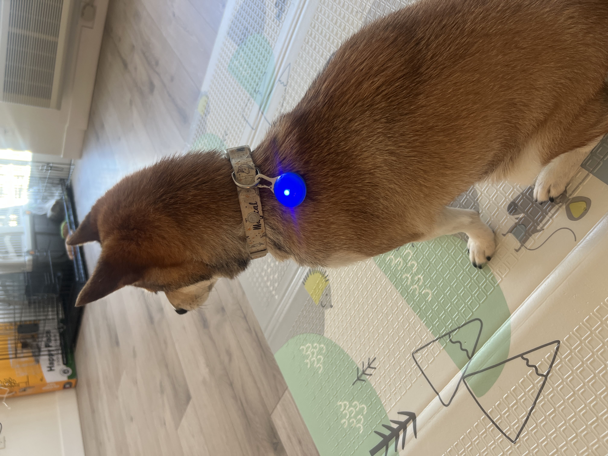

# Staging Interaction

\*\***NAME OF COLLABORATOR HERE**\*\*
## Name: Maggie Liang(ml2927) Xueer Zhang(xz946) Xinwei Xie(xx2185)

In the original stage production of Peter Pan, Tinker Bell was represented by a darting light created by a small handheld mirror off-stage, reflecting a little circle of light from a powerful lamp. Tinkerbell communicates her presence through this light to the other characters. See more info [here](https://en.wikipedia.org/wiki/Tinker_Bell). 

There is no actor that plays Tinkerbell--her existence in the play comes from the interactions that the other characters have with her.

For lab this week, we draw on this and other inspirations from theatre to stage interactions with a device where the main mode of display/output for the interactive device you are designing is lighting. You will plot the interaction with a storyboard, and use your computer and a smartphone to experiment with what the interactions will look and feel like. 

_Make sure you read all the instructions and understand the whole of the laboratory activity before starting!_

## Lab Overview
For this assignment, you are going to:

A) [Plan](#part-a-plan) 

B) [Act out the interaction](#part-b-act-out-the-interaction) 

C) [Prototype the device](#part-c-prototype-the-device)

D) [Wizard the device](#part-d-wizard-the-device) 

E) [Costume the device](#part-e-costume-the-device)

F) [Record the interaction](#part-f-record)

Labs are due on Mondays. Make sure this page is linked to on your main class hub page.

## Part A. Plan 

To stage an interaction with your interactive device, think about:

_Setting:_ Where is this interaction happening? (e.g., a jungle, the kitchen) When is it happening?

_Players:_ Who is involved in the interaction? Who else is there? If you reflect on the design of current day interactive devices like the Amazon Alexa, it’s clear they didn’t take into account people who had roommates, or the presence of children. Think through all the people who are in the setting.

_Activity:_ What is happening between the actors?

_Goals:_ What are the goals of each player? (e.g., jumping to a tree, opening the fridge). 

The interactive device can be anything *except* a computer, a tablet computer or a smart phone, but the main way it interacts needs to be using light.

\*\***Describe your setting, players, activity and goals here.**\*\*
### Topic
Our design for the "Tinkerbell Light" is a smart pet lamp. The lamp features an LED light and sensors that monitor the pet's activity and heart rate, changing the light color according to the pet’s mood.

### Setting
The interaction takes place in the living room in the evening, with the owner present.

### Players
- Pet Dog
- Pet Owner  
- The Pet Mood Lamp (the “Tinkerbell light”)

### Activity
- The pet is in different states (calm, restless, asleep).
- The sensor light responds with lighting changes:
  - Blue → Rest
  - Green → Normal  
  - Yellow → Exciting
  - Red → Anxiety
- The owner interprets the lamp’s colors and decides how to react (e.g., feed, play, or leave the pet to rest).

### Goals
- The pet wants to express needs (comfort, food, attention).
- The owner wants to understand the pet without guesswork.
- The lamp acts as a “translator” between them using only light.

Storyboards are a tool for visually exploring a users interaction with a device. They are a fast and cheap method to understand user flow, and iterate on a design before attempting to build on it. Take some time to read through this explanation of [storyboarding in UX design](https://www.smashingmagazine.com/2017/10/storyboarding-ux-design/). Sketch seven storyboards of the interactions you are planning. **It does not need to be perfect**, but must get across the behavior of the interactive device and the other characters in the scene. 

\*\***Include pictures of your storyboards here**\*\*

Present your ideas to the other people in your breakout room (or in small groups). You can just get feedback from one another or you can work together on the other parts of the lab.

\*\***Summarize feedback you got here.**\*\*
We received feedback from another group suggesting we clarify how the pet's mood is monitored. After research, we found that similar to how an Apple Watch monitors blood pressure and heart rate, we can implement a collar for the pet to wear to track these metrics.

## Part B. Act out the Interaction

Try physically acting out the interaction you planned. For now, you can just pretend the device is doing the things you’ve scripted for it. 

\*\***Are there things that seemed better on paper than acted out?**\*\*
Yes. On paper, mapping the dog’s emotional states directly to light colors (e.g., red = anxious, blue = calm) seemed straightforward. However, during the acted-out scenario, we realized the dog’s behavior is unpredictable and cannot be perfectly controlled to match the storyboard.

\*\***Are there new ideas that occur to you or your collaborator that come up from the acting?**\*\*
We discovered that adding auditory alerts could further help remind the owner about the pet’s current state.

## Part C. Prototype the device

You will be using your smartphone as a stand-in for the device you are prototyping. You will use the browser of your smart phone to act as a “light” and use a remote control interface to remotely change the light on that device. 

Code for the "Tinkerbelle" tool, and instructions for setting up the server and your phone are [here](https://github.com/IRL-CT/tinkerbelle).

We invented this tool for this lab! 

If you run into technical issues with this tool, you can also use a light switch, dimmer, etc. that you can can manually or remotely control.

\*\***Give us feedback on Tinkerbelle.**\*\*
We used a smartphone as a stand-in for the device, with its browser acting as a “light” and a remote control interface to change the light color.

We successfully built the system and set up remote control. One piece of feedback is that Tinkerbelle does not support entering color codes directly, which makes re-selecting the same color on the palette difficult unless using the default provided colors.

## Part D. Wizard the device
Take a little time to set up the wizarding set-up that allows for someone to remotely control the device while someone acts with it. Hint: You can use Zoom to record videos, and you can pin someone’s video feed if that is the scene which you want to record. 

\*\***Include your first attempts at recording the set-up video here.**\*\*
*[First Attempt](https://www.youtube.com/shorts/a3TpJAGhahQ)*

Now, change the goal within the same setting, and update the interaction with the paper prototype. 

\*\***Show the follow-up work here.**\*\*

### Setup the Device
*[Setup the Device](https://www.youtube.com/watch?v=D4cC2wBMVeg)*

We used the device to interact with a cat, using two color signals: blue for "rest" and yellow for "feeding."

### Updated Interaction After Paper Prototyping
*[Updated Attempt](https://youtu.be/2MFH3JHRcug)*

After refining the storyboard, we applied the interaction to a dog with 4 colors.
- The sensor light responds with lighting changes:
  - Blue → Rest
  - Green → Normal  
  - Yellow → Exciting
  - Red → Anxiety

## Part E. Costume the device

Only now should you start worrying about what the device should look like. Develop three costumes so that you can use your phone as this device.

Think about the setting of the device: is the environment a place where the device could overheat? Is water a danger? Does it need to have bright colors in an emergency setting?

\*\***Include sketches of what your devices might look like here.**\*\*

\*\***What concerns or opportunitities are influencing the way you've designed the device to look?**\*\*

- **Dog’s comfort**: Lights should be soft, not harsh or strobing, to avoid frightening or stressing the dog.
- **Light transitions**: Should be gradual (fade-in/fade-out) for a calming effect.
- **Environmental factors**: The device should be safe from overheating and water exposure, especially in a living room setting.
- **Visibility**: Colors should be bright enough to be noticeable but not overwhelming.

## Part F. Record

\*\***Take a video of your prototyped interaction.**\*\*
### [Updated Interaction After Paper Prototyping](https://youtu.be/2MFH3JHRcug)
\*\***Please indicate who you collaborated with on this Lab.**\*\*
Be generous in acknowledging their contributions! And also recognizing any other influences (e.g. from YouTube, Github, Twitter) that informed your design. 

# Staging Interaction, Part 2 

This describes the second week's work for this lab activity.

## Prep (to be done before Lab on Wednesday)

You will be assigned three partners from other groups. Go to their github pages, view their videos, and provide them with reactions, suggestions & feedback: explain to them what you saw happening in their video. Guess the scene and the goals of the character. Ask them about anything that wasn’t clear. 

\*\***Summarize feedback from your partners here.**\*\*

## Make it your own

Do last week’s assignment again, but this time: 
1) It doesn’t have to (just) use light, 
2) You can use any modality (e.g., vibration, sound) to prototype the behaviors! Again, be creative! Feel free to fork and modify the tinkerbell code! 
3) We will be grading with an emphasis on creativity. 

\*\***Document everything here. (Particularly, we would like to see the storyboard and video, although photos of the prototype are also great.)**\*\*
