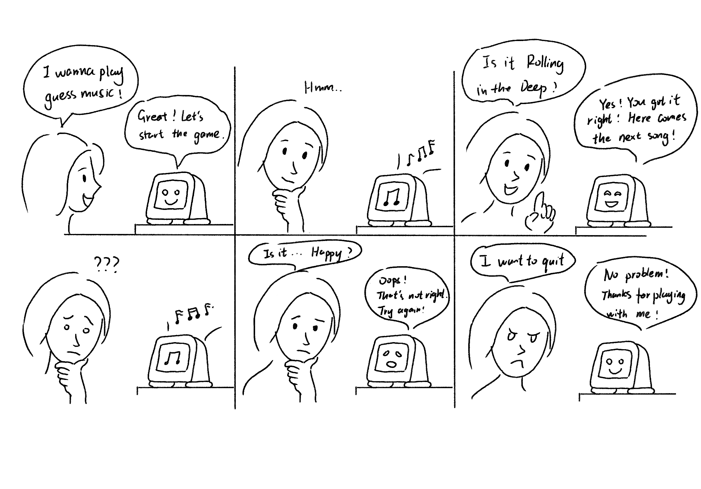
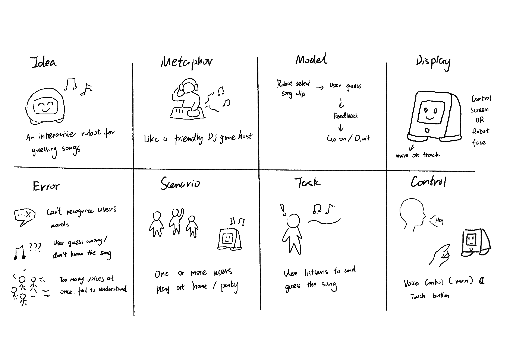

# Chatterboxes
Name: Maggie Liang(ml2927) Xueer Zhang(xz946) Xinwei Xie(xx2185)

# Lab 3 Part 1 
### Storyboard





*[See Document](https://docs.google.com/document/d/1e_OX-vOWRYc_an2_wXuBSy633hKnThJmf2AJ_P2LgNg/edit?tab=t.0)*

### Acting out the dialogue

Script Design

We designed a script for the Music Guessing Chatterbox with three main characters: a Host who introduces the system, a Robot that plays music and gives feedback, and a User who interacts with the game. The script includes several important interaction scenarios.
First, the Robot introduces itself and explains the game rules. It tells users that it will play songs and they should try to guess the song names. The Robot can respond to both correct and incorrect guesses. When users guess correctly, the Robot confirms their answer and moves to the next song. When users guess incorrectly, the Robot encourages them to try again and replays the music. Users can also quit the game at any time by saying they want to stop.
Acting Out the Dialogue
We tested the dialogue by acting it out with a partner. One person played the role of the Robot device, and the other person played the User. We did not share the script with the User beforehand to see how natural the interaction felt.

Observations from Testing

The dialogue felt different when we acted it out compared to what we imagined. Several issues became clear during the test. The timing between playing music and waiting for guesses was difficult to get right. Sometimes the Robot spoke too quickly and users did not have enough time to think. Other times there were awkward silences when the Robot waited too long for a response.
The feedback messages also seemed repetitive when acted out multiple times. Hearing "Oops! That's not right. Try again!" several times in a row felt discouraging rather than encouraging. We realized the system needed more variety in its responses to keep users engaged.
Another important finding was that users were confused about what exactly they should say. They were not sure if they should say "the song is..." or just say the song name directly. The script did not give clear enough instructions about the expected format for answers.
Finally, we noticed that the music playing sounds ("♪ ♫ ♪") worked well in the written script but were hard to act out in real life. We realized we needed to think more carefully about how the actual music would be played and how long each clip should be.
These observations helped us understand what needed to be improved for Part 2 of the project.

*[Dialogue Video](https://drive.google.com/file/d/1YpRYrWIZNIVNQHW5lIoD8B3Sx3k7n2K-/view?usp=sharing)*


https://github.com/user-attachments/assets/287168e8-c2c2-49f8-971a-7511b35cceb1


# Lab 3 Part 2 Music Guessing Game
### Project Overview
This is a music guessing game that uses a Raspberry Pi. Players listen to song clips and try to guess the song name by speaking to the system.
[The link to our demo](https://drive.google.com/file/d/1LMfZVcPqiEs-d2FYJQiQ2slWikf9R6w-/view?usp=sharing)

1. Design Improvements
We made several improvements based on Part 1 feedback:

- Clearer Instructions: We used more clear and standard wording to give users instructions
- Lower Difficulty: We made the song guessing process easier for players

2. Interaction Modes and System Design
The system uses speech interaction:

Users must click a button on the webpage to start the game.
And the speaker will instruct the user to play the game.
After each game, users need to reset and click start again to play

The system includes:

Raspberry Pi: Main controller
Speaker and Web Camera

System Control:
Speech Input: Players speak their guesses to the system

3. New Storyboard


### Testing Results
#### What Worked Well
The controller performed smoothly during testing. It played music without problems and responded quickly to user inputs. The basic game flow worked as we expected. Players could start the game, hear songs, make guesses, and receive feedback from the system.

#### What Didn't Work Well
We found several problems during testing. The biggest issue was voice recognition. The system had difficulty understanding what players said. Sometimes players guessed the correct song name, but the system did not recognize it. The system also required exact matching. Players had to say the exact song name without adding or missing any words. This was very frustrating for users. Another problem was song length. Many users told us the music intro was too short. They could not recognize the song before it ended. Users also wanted more features. When they could not guess a song, they wanted to hear more of it, but the system did not have this option.

#### Lessons Learned
I learned that designing a system requires thinking about human factors. People who use the system for the first time need clear guidance and instructions so they understand how to play. They also need forgiveness for small mistakes because people naturally speak in different ways. Users need enough time to think and respond, especially when listening to music they are trying to remember. The system should also provide flexible input methods because strict rules make the game less fun and more frustrating.

#### Future Dataset Collection
The system could collect useful data for improvement. We could record all user guesses to create a voice dataset with both correct and incorrect answers. We could measure response time to see how long users take to guess each song. This would help us understand song difficulty and rate songs based on how often users guess correctly. We could also track error patterns to find common mistakes in voice recognition. This data could help make the game better and more user-friendly in future versions.


[](https://www.youtube.com/embed/Q8FWzLMobx0?start=19)


### Get the Latest Content ✅️

As always, pull updates from the class Interactive-Lab-Hub to both your Pi and your own GitHub repo. There are 2 ways you can do so:

**\[recommended\]**Option 1: On the Pi, `cd` to your `Interactive-Lab-Hub`, pull the updates from upstream (class lab-hub) and push the updates back to your own GitHub repo. You will need the *personal access token* for this.

```
pi@ixe00:~$ cd Interactive-Lab-Hub
pi@ixe00:~/Interactive-Lab-Hub $ git pull upstream Fall2025
pi@ixe00:~/Interactive-Lab-Hub $ git add .
pi@ixe00:~/Interactive-Lab-Hub $ git commit -m "get lab3 updates"
pi@ixe00:~/Interactive-Lab-Hub $ git push
```

Option 2: On your your own GitHub repo, [create pull request](https://github.com/FAR-Lab/Developing-and-Designing-Interactive-Devices/blob/2022Fall/readings/Submitting%20Labs.md) to get updates from the class Interactive-Lab-Hub. After you have latest updates online, go on your Pi, `cd` to your `Interactive-Lab-Hub` and use `git pull` to get updates from your own GitHub repo.

## Part 1.
### Setup ✅️

Activate your virtual environment

```
pi@ixe00:~$ cd Interactive-Lab-Hub
pi@ixe00:~/Interactive-Lab-Hub $ cd Lab\ 3
pi@ixe00:~/Interactive-Lab-Hub/Lab 3 $ python3 -m venv .venv
pi@ixe00:~/Interactive-Lab-Hub $ source .venv/bin/activate
(.venv)pi@ixe00:~/Interactive-Lab-Hub $ 
```

Run the setup script
```(.venv)pi@ixe00:~/Interactive-Lab-Hub $ pip install -r requirements.txt  ```

Next, run the setup script to install additional text-to-speech dependencies:
```
(.venv)pi@ixe00:~/Interactive-Lab-Hub/Lab 3 $ ./setup.sh
```

### Text to Speech ✅️

In this part of lab, we are going to start peeking into the world of audio on your Pi! 

We will be using the microphone and speaker on your webcamera. In the directory is a folder called `speech-scripts` containing several shell scripts. `cd` to the folder and list out all the files by `ls`:

```
pi@ixe00:~/speech-scripts $ ls
Download        festival_demo.sh  GoogleTTS_demo.sh  pico2text_demo.sh
espeak_demo.sh  flite_demo.sh     lookdave.wav
```

You can run these shell files `.sh` by typing `./filename`, for example, typing `./espeak_demo.sh` and see what happens. Take some time to look at each script and see how it works. You can see a script by typing `cat filename`. For instance:

```
pi@ixe00:~/speech-scripts $ cat festival_demo.sh 
#from: https://elinux.org/RPi_Text_to_Speech_(Speech_Synthesis)#Festival_Text_to_Speech
```
You can test the commands by running
```
echo "Just what do you think you're doing, Dave?" | festival --tts
```

Now, you might wonder what exactly is a `.sh` file? 
Typically, a `.sh` file is a shell script which you can execute in a terminal. The example files we offer here are for you to figure out the ways to play with audio on your Pi!

You can also play audio files directly with `aplay filename`. Try typing `aplay lookdave.wav`.

\*\***Write your own shell file to use your favorite of these TTS engines to have your Pi greet you by name.**\*\*
(This shell file should be saved to your own repo for this lab.)

*[See greet.sh](https://github.com/m-lmq/Interactive-Lab-Hub/blob/Fall2025/Lab%203/speech-scripts/greet.sh)*

---
Bonus:
[Piper](https://github.com/rhasspy/piper) is another fast neural based text to speech package for raspberry pi which can be installed easily through python with:
```
pip install piper-tts
```
and used from the command line. Running the command below the first time will download the model, concurrent runs will be faster. 
```
echo 'Welcome to the world of speech synthesis!' | piper \
  --model en_US-lessac-medium \
  --output_file welcome.wav
```
Check the file that was created by running `aplay welcome.wav`. Many more languages are supported and audio can be streamed dirctly to an audio output, rather than into an file by:

```
echo 'This sentence is spoken first. This sentence is synthesized while the first sentence is spoken.' | \
  piper --model en_US-lessac-medium --output-raw | \
  aplay -r 22050 -f S16_LE -t raw -
```
  
### Speech to Text ✅️

Next setup speech to text. We are using a speech recognition engine, [Vosk](https://alphacephei.com/vosk/), which is made by researchers at Carnegie Mellon University. Vosk is amazing because it is an offline speech recognition engine; that is, all the processing for the speech recognition is happening onboard the Raspberry Pi. 

Make sure you're running in your virtual environment with the dependencies already installed:
```
source .venv/bin/activate
```

Test if vosk works by transcribing text:

```
vosk-transcriber -i recorded_mono.wav -o test.txt
```

You can use vosk with the microphone by running 
```
python test_microphone.py -m en
```

---
Bonus:
[Whisper](https://openai.com/index/whisper/) is a neural network–based speech-to-text (STT) model developed and open-sourced by OpenAI. Compared to Vosk, Whisper generally achieves higher accuracy, particularly on noisy audio and diverse accents. It is available in multiple model sizes; for edge devices such as the Raspberry Pi 5 used in this class, the tiny.en model runs with reasonable latency even without a GPU.

By contrast, Vosk is more lightweight and optimized for running efficiently on low-power devices like the Raspberry Pi. The choice between Whisper and Vosk depends on your scenario: if you need higher accuracy and can afford slightly more compute, Whisper is preferable; if your priority is minimal resource usage, Vosk may be a better fit.

In this class, we provide two Whisper options: A quantized 8-bit faster-whisper model for speed, and the standard Whisper model. Try them out and compare the trade-offs.

Make sure you're in the Lab 3 directory with your virtual environment activated:
```
cd ~/Interactive-Lab-Hub/Lab\ 3/speech-scripts
source ../.venv/bin/activate
```

Then test the Whisper models:
```
python whisper_try.py
```
and

```
python faster_whisper_try.py
```
\*\***Write your own shell file that verbally asks for a numerical based input (such as a phone number, zipcode, number of pets, etc) and records the answer the respondent provides.**\*\*

*[See number_input.sh](https://github.com/m-lmq/Interactive-Lab-Hub/blob/Fall2025/Lab%203/speech-scripts/number_input.sh)*

### 🤖 NEW: AI-Powered Conversations with Ollama

Want to add intelligent conversation capabilities to your voice projects? **Ollama** lets you run AI models locally on your Raspberry Pi for sophisticated dialogue without requiring internet connectivity!

#### Quick Start with Ollama

**Installation** (takes ~5 minutes):
```bash
# Install Ollama
curl -fsSL https://ollama.com/install.sh | sh

# Download recommended model for Pi 5
ollama pull phi3:mini

# Install system dependencies for audio (required for pyaudio)
sudo apt-get update
sudo apt-get install -y portaudio19-dev python3-dev

# Create separate virtual environment for Ollama (due to pyaudio conflicts)
cd ollama/
python3 -m venv ollama_venv
source ollama_venv/bin/activate

# Install Python dependencies in separate environment
pip install -r ollama_requirements.txt
```
#### Ready-to-Use Scripts

We've created three Ollama integration scripts for different use cases:

**1. Basic Demo** - Learn how Ollama works:
```bash
python3 ollama_demo.py
```

**2. Voice Assistant** - Full speech-to-text + AI + text-to-speech:
```bash
python3 ollama_voice_assistant.py
```

**3. Web Interface** - Beautiful web-based chat with voice options:
```bash
python3 ollama_web_app.py
# Then open: http://localhost:5000
```

#### Integration in Your Projects

Simple example to add AI to any project:
```python
import requests

def ask_ai(question):
    response = requests.post(
        "http://localhost:11434/api/generate",
        json={"model": "phi3:mini", "prompt": question, "stream": False}
    )
    return response.json().get('response', 'No response')

# Use it anywhere!
answer = ask_ai("How should I greet users?")
```

**📖 Complete Setup Guide**: See `OLLAMA_SETUP.md` for detailed instructions, troubleshooting, and advanced usage!

\*\***Try creating a simple voice interaction that combines speech recognition, Ollama processing, and text-to-speech output. Document what you built and how users responded to it.**\*\*

*[See mini_voice_assistant.py](https://github.com/m-lmq/Interactive-Lab-Hub/blob/Fall2025/Lab%203/ollama/mini_voice_assistant.py)*

### Serving Pages

In Lab 1, we served a webpage with flask. In this lab, you may find it useful to serve a webpage for the controller on a remote device. Here is a simple example of a webserver.

```
pi@ixe00:~/Interactive-Lab-Hub/Lab 3 $ python server.py
 * Serving Flask app "server" (lazy loading)
 * Environment: production
   WARNING: This is a development server. Do not use it in a production deployment.
   Use a production WSGI server instead.
 * Debug mode: on
 * Running on http://0.0.0.0:5000/ (Press CTRL+C to quit)
 * Restarting with stat
 * Debugger is active!
 * Debugger PIN: 162-573-883
```
From a remote browser on the same network, check to make sure your webserver is working by going to `http://<YourPiIPAddress>:5000`. You should be able to see "Hello World" on the webpage.


### Wizarding with the Pi (optional)
In the [demo directory](./demo), you will find an example Wizard of Oz project. In that project, you can see how audio and sensor data is streamed from the Pi to a wizard controller that runs in the browser.  You may use this demo code as a template. By running the `app.py` script, you can see how audio and sensor data (Adafruit MPU-6050 6-DoF Accel and Gyro Sensor) is streamed from the Pi to a wizard controller that runs in the browser `http://<YouPiIPAddress>:5000`. You can control what the system says from the controller as well!

\*\***Describe if the dialogue seemed different than what you imagined, or when acted out, when it was wizarded, and how.**\*\*


